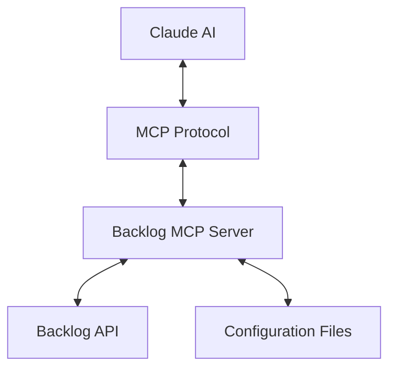
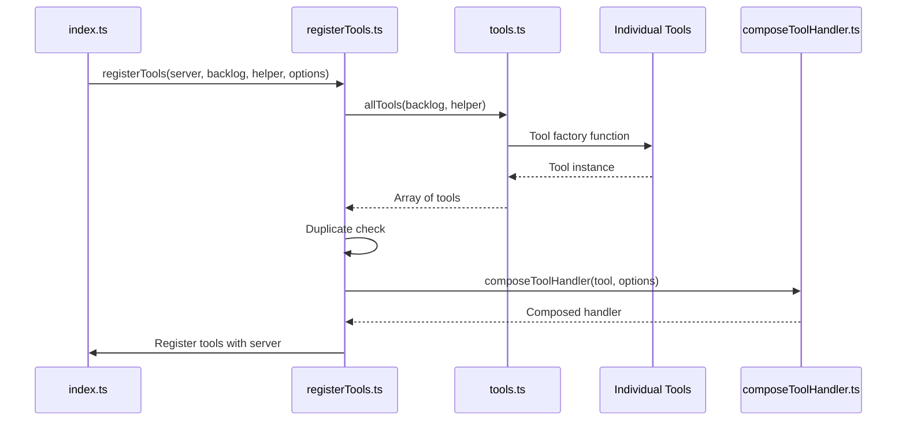
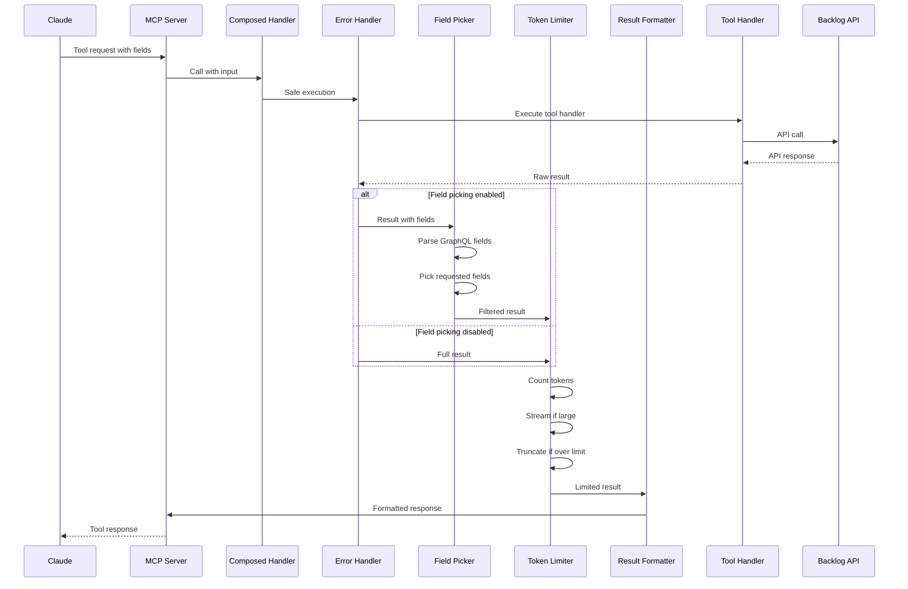
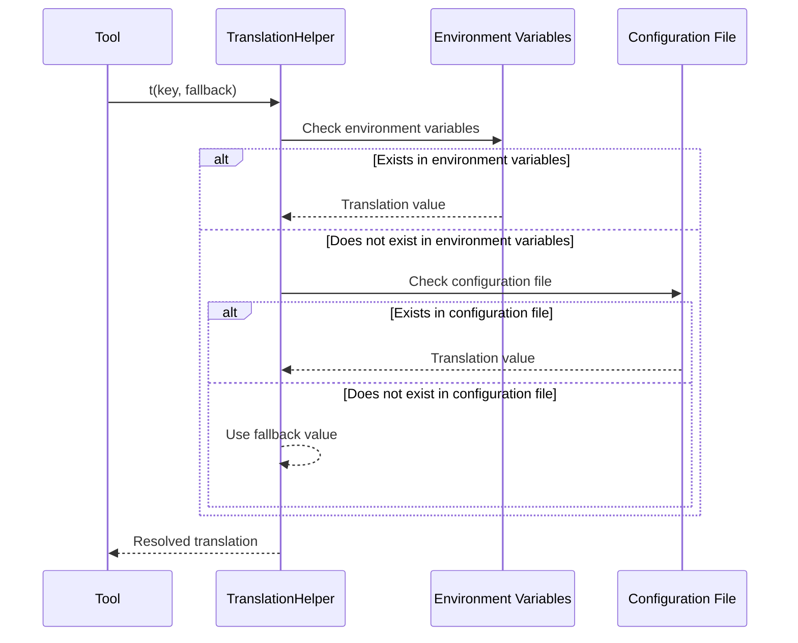
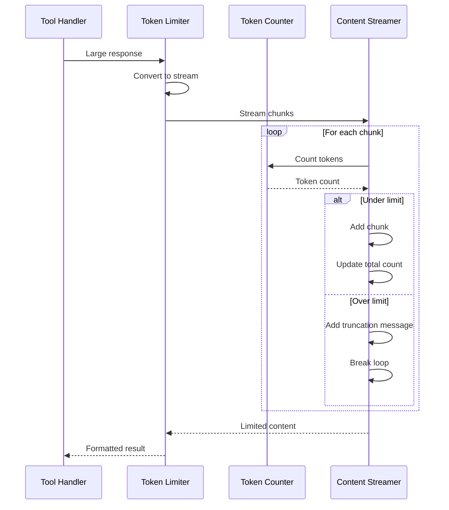
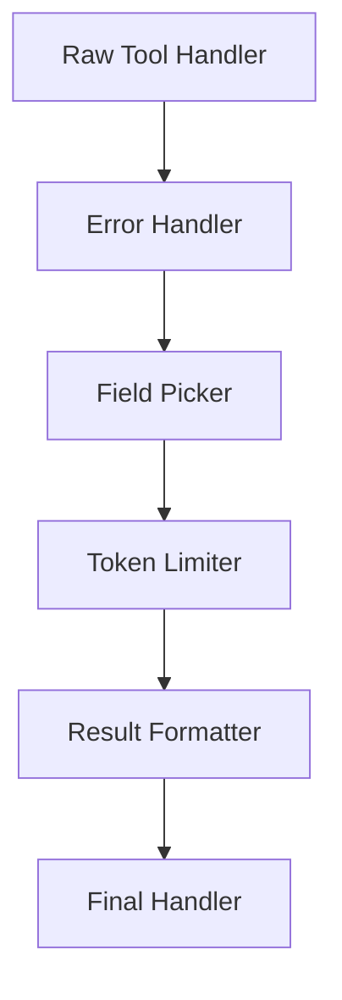

# System Patterns

## Architecture Overview

The Backlog MCP Server functions as a bridge between Claude and the Backlog API using the Model Context Protocol (MCP). The system consists of the following main components:



## Main Components

### 1. MCP Server
- Implements an MCP server using `@modelcontextprotocol/sdk`
- Communicates with Claude etc through standard input/output (stdio)
- Manages tool registration and execution

### 2. Tool Definition System
- Defines tools corresponding to each Backlog API endpoint
- Validates input parameters using Zod schemas
- Returns data in a unified response format

### 3. Translation System
- Translation helper for multi-language support
- Loads translations from configuration files or environment variables
- Ensures descriptions are always displayed with fallback functionality

### 4. Backlog API Client
- Communicates with the Backlog API using the `backlog-js` library
- Retrieves authentication information from environment variables
- Each tool uses the API client to perform operations

## Design Patterns

### 1. Factory Pattern
- The `allTools` function receives a Backlog client and translation helper, generating instances of all tools
- Each tool has its own definition and implementation while providing a unified interface

### 2. Dependency Injection
- Backlog client and translation helper are injected into tools
- Mock objects can be injected during testing for easier unit testing
- Options for field picking and token limiting are injected into handlers

### 3. Adapter Pattern
- Converts Backlog API responses to MCP tool output format
- Adapts diverse response formats from different API endpoints to a unified format

### 4. Strategy Pattern
- Translation system selects appropriate translations from different sources (environment variables, configuration files, default values)
- Provides optimal translations based on priority

### 5. Decorator Pattern
- Tool handlers are wrapped with various transformers (error handling, field picking, token limiting, result formatting)
- Each transformer adds specific functionality while maintaining the same interface
- Transformers can be composed in different orders based on requirements

### 6. Pipeline Pattern
- Response processing follows a clear pipeline: handler → error handling → field picking → token limiting → result formatting
- Each step in the pipeline processes the data and passes it to the next step

## Important Implementation Paths

### Tool Registration Flow


### Request Processing Flow


### Translation Resolution Flow


### Token Limiting Flow


## Component Relationships

### Tool Structure
Each tool has the following structure:
- **Name**: Identifier representing the API endpoint
- **Description**: Description of the tool's functionality (translatable)
- **Schema**: Definition of input parameters (Zod)
- **OutputSchema**: Definition of output structure (Zod, for field picking)
- **ImportantFields**: List of fields that are most commonly needed (for examples)
- **Handler**: Function that performs the actual processing

### Handler Composition Structure


### File Structure
```
src/
├── index.ts              # Entry point
├── registerTools.ts      # Tool registration logic
├── createTranslationHelper.ts # Translation helper
├── backlog/
│   ├── backlogErrorHandler.ts # Backlog-specific error handling
│   └── parseBacklogAPIError.ts # Error parsing utilities
├── handlers/
│   ├── builders/
│   │   └── composeToolHandler.ts # Handler composition
│   └── transformers/
│       ├── wrapWithErrorHandling.ts # Error handling transformer
│       ├── wrapWithFieldPicking.ts # Field picking transformer
│       ├── wrapWithTokenLimit.ts # Token limiting transformer
│       └── wrapWithToolResult.ts # Result formatting transformer
├── tools/
│   ├── tools.ts          # Exports all tools
│   ├── getSpace.ts       # Individual tool implementation
│   ├── getSpace.test.ts  # Corresponding test
│   └── ...               # Other tools
├── types/
│   ├── mcp.ts            # MCP-related types
│   ├── result.ts         # Result types
│   ├── tool.ts           # Tool definition types
│   └── zod/              # Zod schema definitions
└── utils/
    ├── contentStreamingWithTokenLimit.ts # Token limiting utilities
    ├── generateFieldsDescription.ts # Field description generation
    ├── runToolSafely.ts  # Safe tool execution
    └── tokenCounter.ts   # Token counting utilities
```

## Test Strategy

- Create unit tests corresponding to each tool
- Use mocks to eliminate external dependencies on the Backlog API
- Focus on validating input parameters and output format
- Use translation helper mocks to test translation functionality
