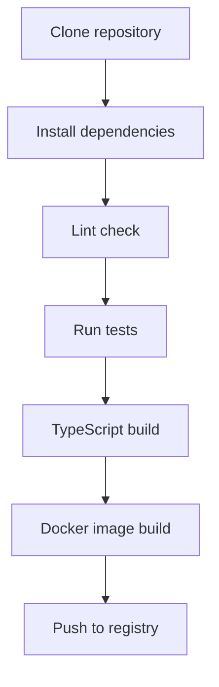

# Technical Context

## Technologies Used

### Languages and Runtime
- **TypeScript**: Static typing for improved safety and development efficiency
- **Node.js**: Server-side JavaScript runtime (v22 or higher recommended)

### Key Libraries
- **@modelcontextprotocol/sdk**: Implementation of MCP (Model Context Protocol) server
- **backlog-js**: Client library to simplify communication with Backlog API
- **zod**: Provides schema validation and type safety
- **cosmiconfig**: Configuration file loading and management
- **dotenv**: Environment variable management
- **graphql**: Used for field selection parsing and processing

### Development Tools
- **Jest**: Testing framework
- **ESLint**: Code quality and style validation
- **Prettier**: Code formatting
- **release-it**: Release management automation

### Containerization
- **Docker**: Application containerization with multi-stage builds
- **GitHub Container Registry**: Container image distribution

## Development Environment Setup

### Prerequisites
- Node.js v22 or higher (recommended)
- npm or yarn
- Git

### Installation Steps
```bash
# Clone the repository
git clone https://github.com/nulab/backlog-mcp-server.git
cd backlog-mcp-server

# Install dependencies
npm install

# Build
npm run build
```

### Environment Variables
Create a `.env` file during development with the following variables:
```
BACKLOG_DOMAIN=your-domain.backlog.com
BACKLOG_API_KEY=your-api-key
```

## Technical Constraints

### Backlog API
- Be mindful of API rate limits
- Some APIs require specific permissions
- API keys are issued per user and operate with that user's permissions
- Large responses may need pagination or token limiting

### MCP Protocol
- Communicates through standard input/output (stdio)
- Tool inputs and outputs must follow specific formats
- Requires support for asynchronous processing
- Response size should be managed to avoid token limit issues

### Containerization
- Multi-stage builds used to maintain lightweight container images
- Supports cross-architecture builds (amd64, arm64)
- Environment variables must be properly passed to containers

## Build and Deploy

### Build Process


### CI/CD
- Automation using GitHub Actions
- Testing and validation for each pull request
- Automatic release on tag push
- Building and publishing multi-architecture Docker images

### Deployment Options
1. **Docker**:
   ```bash
   docker run -i --rm \
     -e BACKLOG_DOMAIN=your-domain.backlog.com \
     -e BACKLOG_API_KEY=your-api-key \
     -v /path/to/.backlog-mcp-serverrc.json:/root/.backlog-mcp-serverrc.json:ro \
     ghcr.io/nulab/backlog-mcp-server
   ```

2. **Node.js**:
   ```bash
   BACKLOG_DOMAIN=your-domain.backlog.com \
   BACKLOG_API_KEY=your-api-key \
   node build/index.js
   ```

## Test Strategy

### Unit Tests
- Testing framework using Jest
- Using mocks to isolate Backlog API dependencies
- Creating test files corresponding to each tool

### Running Tests
```bash
# Run all tests
npm test

# Run specific tests
npm test -- -t "getSpace"
```

## Performance Considerations

- Minimizing API requests
- Appropriate error handling and retry strategies
- Pagination handling when dealing with large amounts of data
- Token limiting for large responses
- Field selection to reduce response size
- Streaming large responses in chunks

## Security Considerations

- Secure management of API keys
- Injection of sensitive information through environment variables
- Principle of least privilege in containers
- Input validation to prevent injection attacks
- GraphQL field selection validation to prevent injection

## Multi-language Support

- Multi-language support through translation files
- Translation overrides through environment variables
- Translation customization through configuration files
- Fallback to default language (English)
- Translation key tracking for consistency

## Response Optimization

### Field Selection
- GraphQL-style field selection syntax
- Allows clients to request only needed fields
- Reduces response size and processing time
- Example: `{ id name description }`

### Token Limiting
- Configurable maximum token limit (default: 50,000)
- Can be set via environment variable or CLI argument
- Automatically truncates large responses
- Streaming implementation for efficient processing

### Error Handling
- Categorized error types (authentication, API, unexpected, unknown)
- Consistent error response format
- Detailed error messages for debugging
- Backlog API-specific error parsing
